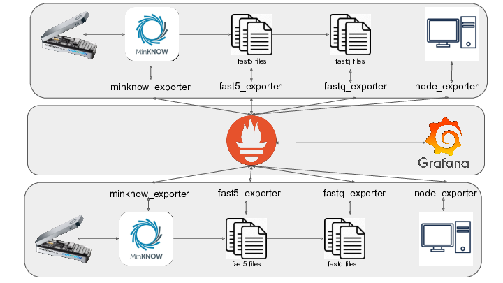
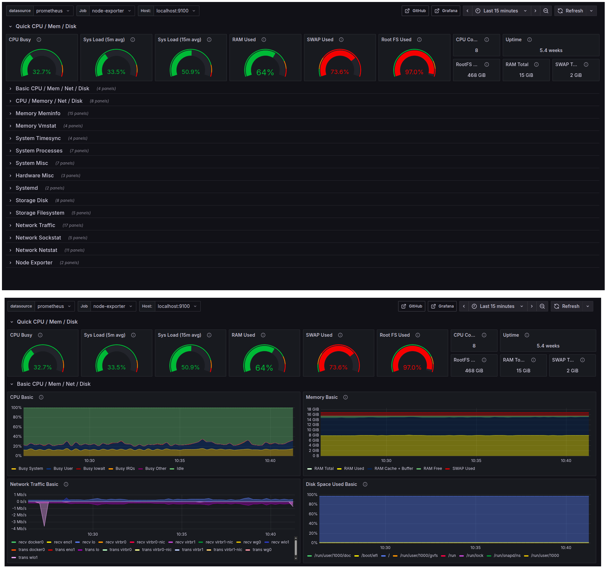
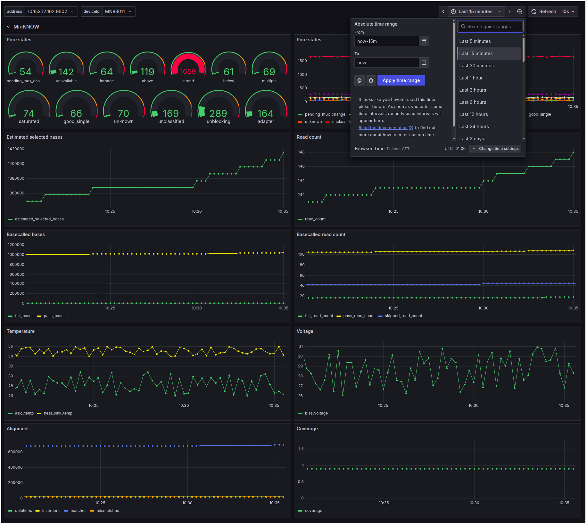
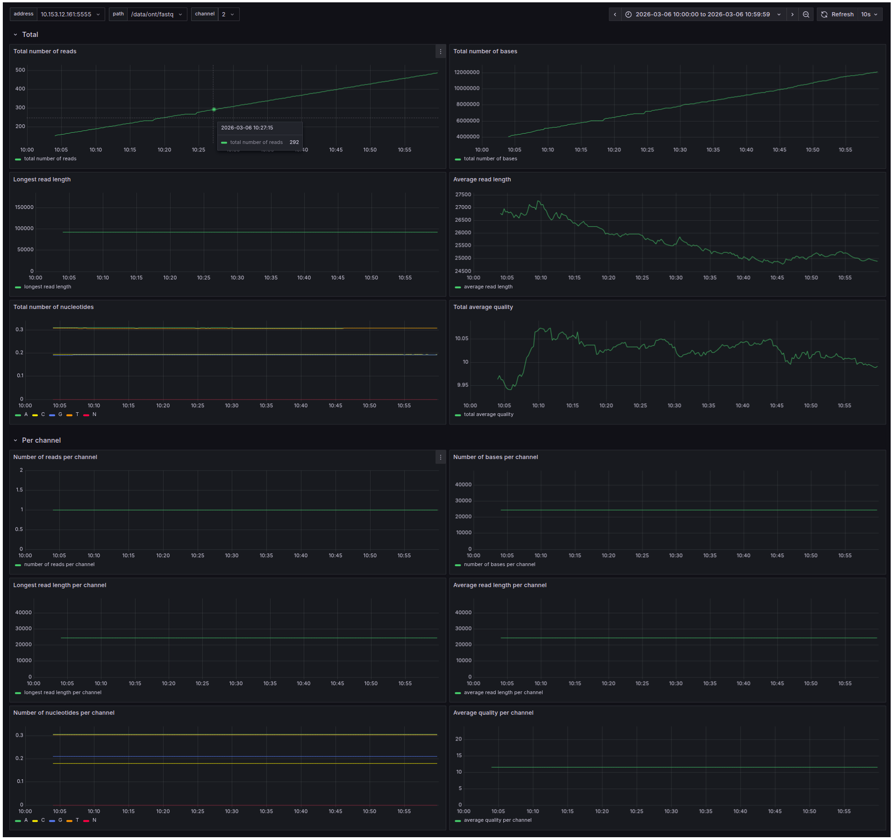
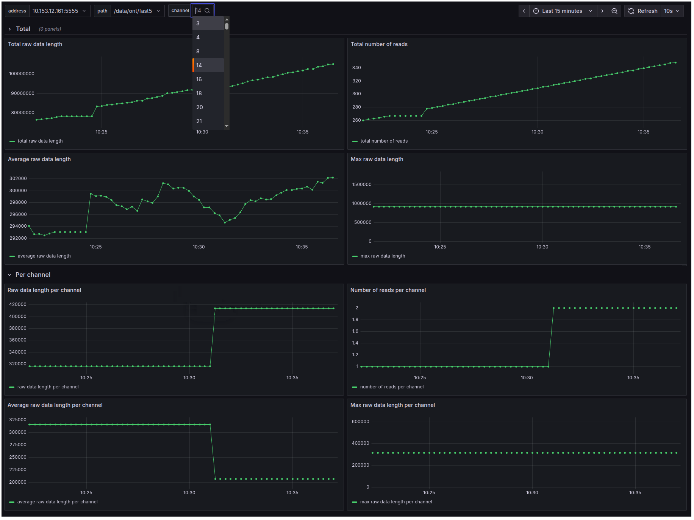

<a name="readme-top"></a>

[![Contributors][contributors-shield]][contributors-url]
[![Forks][forks-shield]][forks-url]
[![Stargazers][stars-shield]][stars-url]
[![Issues][issues-shield]][issues-url]
[![License][license-shield]][license-url]

<br />
<div align="center">
  <h1 align="center">mONiTor</h1>

  <p align="center">
    Real-time monitoring system for Oxford Nanopore sequencing runs
    <br />
    <!--<a href="http://eve.ii.pw.edu.pl:9007/dashboards/?tag=mONiTor"><strong>View Demo</strong></a>-->
    <!--·-->
    <a href="https://github.com/wkusmirek/mONiTor/issues">Report Bug</a>
    ·
    <a href="https://github.com/wkusmirek/mONiTor/issues">Request Feature</a>
  </p>
</div>

---

## Overview

**mONiTor** is an open-source platform for real-time monitoring of Oxford Nanopore sequencing experiments.  
It integrates sequencing metrics, system performance, and file-based statistics into a unified and scalable dashboard.

The system is built using:

- **Prometheus** – metrics collection and storage  
- **Grafana** – visualization and alerting  
- Custom exporters for sequencing and system-level data  

Designed for both **single-device setups** and **large sequencing facilities**.

---

## Motivation

Nanopore sequencing provides real-time, long-read DNA analysis with high throughput.  
However, existing monitoring tools:

- are often closed-source  
- lack extensibility  
- do not monitor system-level resources  
- are not easily scalable  

**mONiTor** addresses these limitations by providing a flexible, open, and scalable monitoring framework.

---

## Features

- Real-time monitoring of sequencing runs  
- Integration with MinKNOW metrics  
- System monitoring (CPU, RAM, disk usage)  
- FAST5 / FASTQ file statistics  
- Interactive dashboards (Grafana)  
- Configurable alerts (e.g. disk usage, pore state)  
- Multi-user support  
- Cloud-ready architecture  
- Scalable across multiple sequencing devices  

---

## Architecture



### Components

- **node_exporter** – system metrics  
- **minknow_exporter** – sequencer metrics  
- **fast5_exporter** – raw signal data  
- **fastq_exporter** – basecalled reads  

- **Prometheus** – time-series database  
- **Grafana** – visualization and alerting  

One central instance can monitor **multiple sequencing devices across different machines**.

---

## Example Dashboards

### System Monitoring (node_exporter)


### Sequencer Metrics (minknow_exporter)


### FASTQ Statistics


### FAST5 Statistics



---

## Getting Started

### Requirements

- Docker
- Docker Compose

---

### Installation

```bash
git clone https://github.com/wkusmirek/mONiTor.git
cd mONiTor
docker-compose up
```

### Access

Open in browser:

```
http://localhost:3000
```

Default credentials:

```
username: admin
password: admin
```

## Use Cases
Monitoring long-running nanopore sequencing experiments
Managing multiple sequencing devices in core facilities
Detecting anomalies (temperature, pore activity, disk usage)
Tracking sequencing output in real time

## Performance
Low CPU and RAM usage
Exporters are passive (triggered by Prometheus)
Linear disk usage growth (Prometheus database)
Suitable for long-running experiments

## Contributing

Contributions are welcome!

- Fork the repository
- Create your branch (feature/your-feature)
- Commit your changes
- Push to your fork
- Open a Pull Request

## License

Distributed under the Apache License 2.0.
See the LICENSE file for details.

## Contact

Wiktor Kuśmirek
wiktor.kusmirek@pw.edu.pl

Project repository:
https://github.com/wkusmirek/mONiTor

## Acknowledgments
https://prometheus.io
https://grafana.com

<p align="right">(<a href="#readme-top">back to top</a>)</p>
<!-- MARKDOWN LINKS -->
